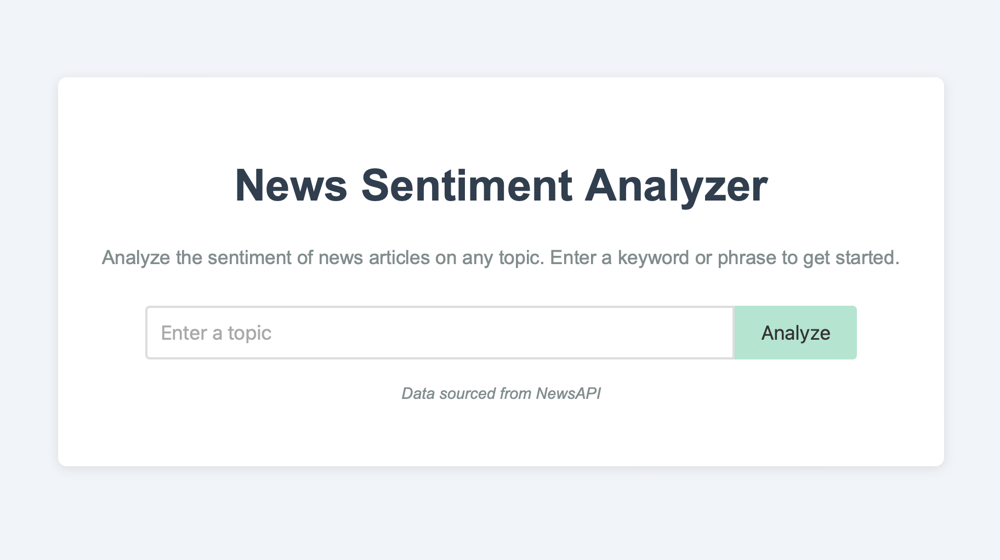
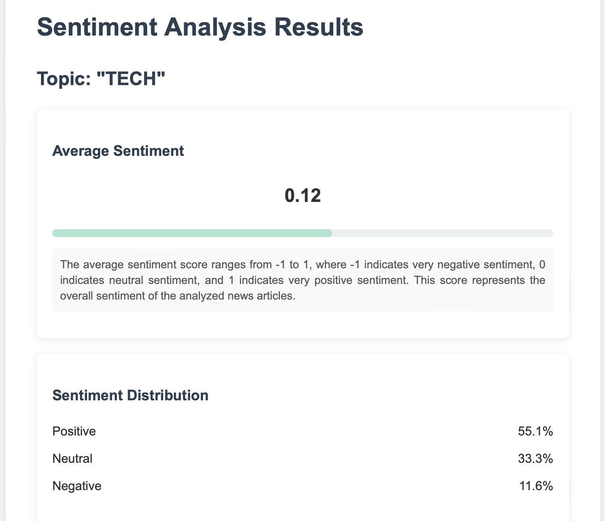
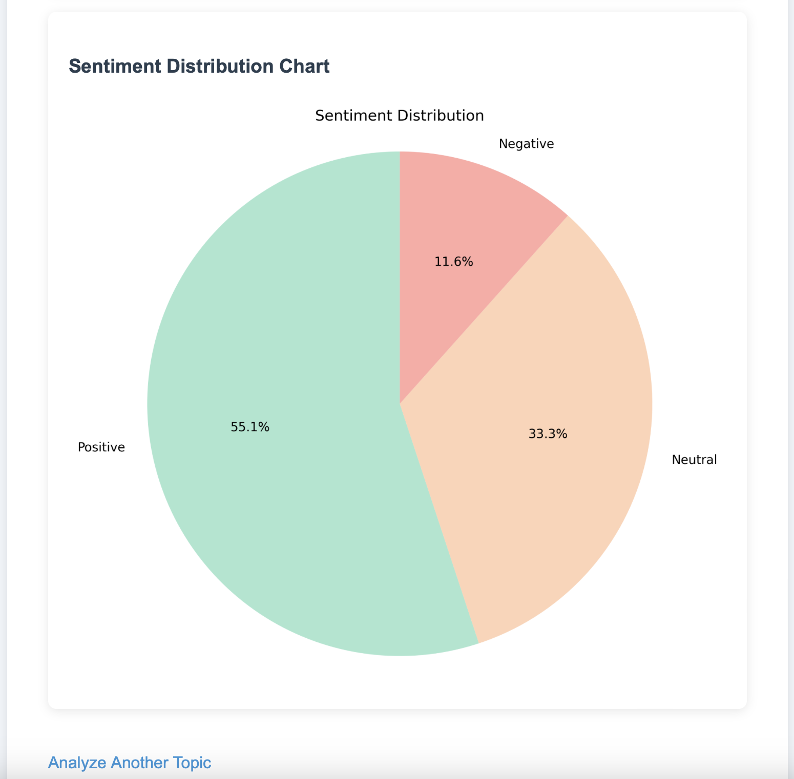

# news_sentiment_analysis_portfolio

This data mining project utilizes the NewsAPI to fetch recent articles on a user-specified topic. It then applies sentiment analysis using TextBlob to determine the overall sentiment of the news coverage. The results are presented through an intuitive web interface, showcasing the average sentiment score and a distribution of positive, neutral, and negative sentiments across the articles.

## ⚙️ Tools & Tech

- Python
- NLTK / SpaCy
- scikit-learn
- Matplotlib / Seaborn
- Jupyter Notebook
- Flask
- Heroku

## 📸 Sample Output

## 🔗 Live Demo / Notebook

👉 [Click here to try the app](https://nsa-02d4c824ca90.herokuapp.com)

## 📜 License

MIT
